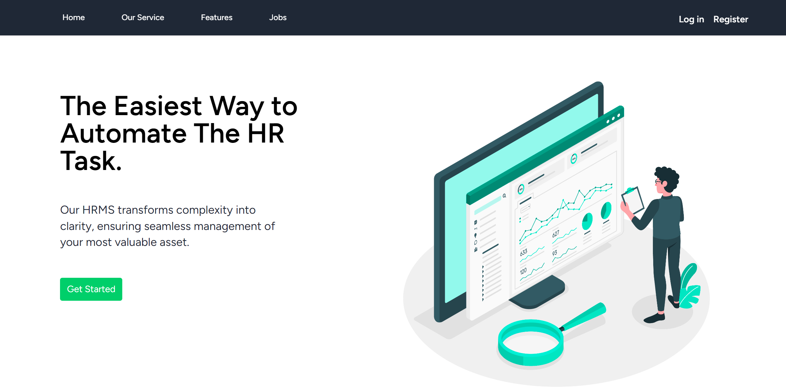
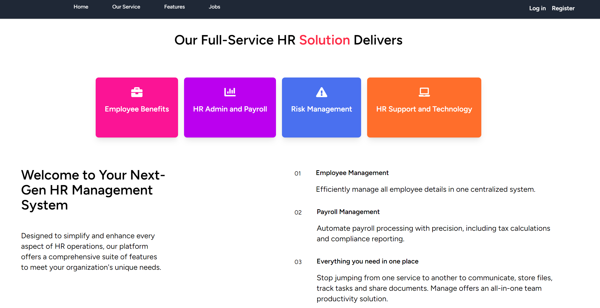
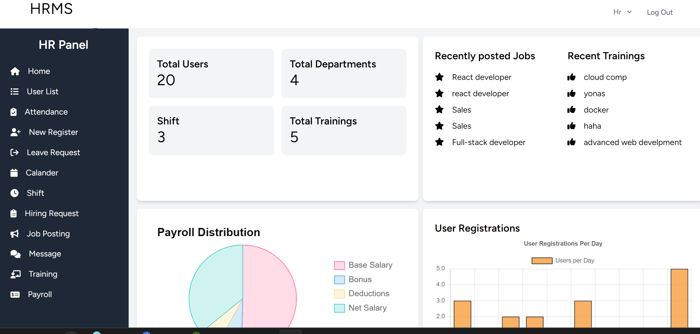
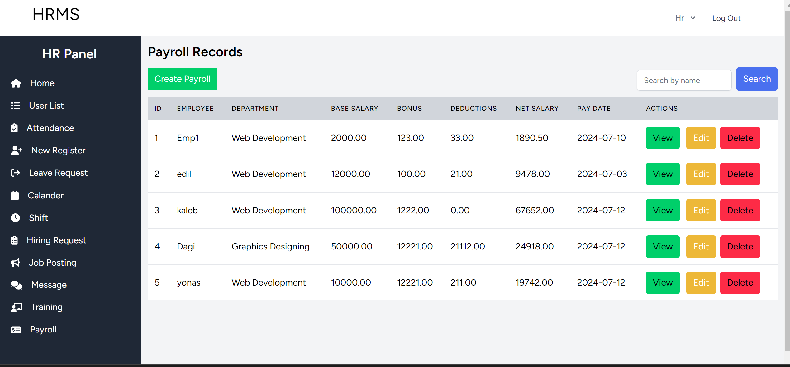
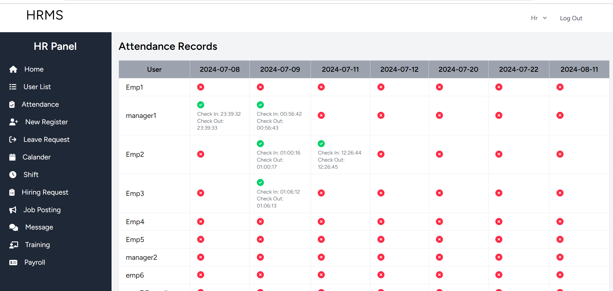
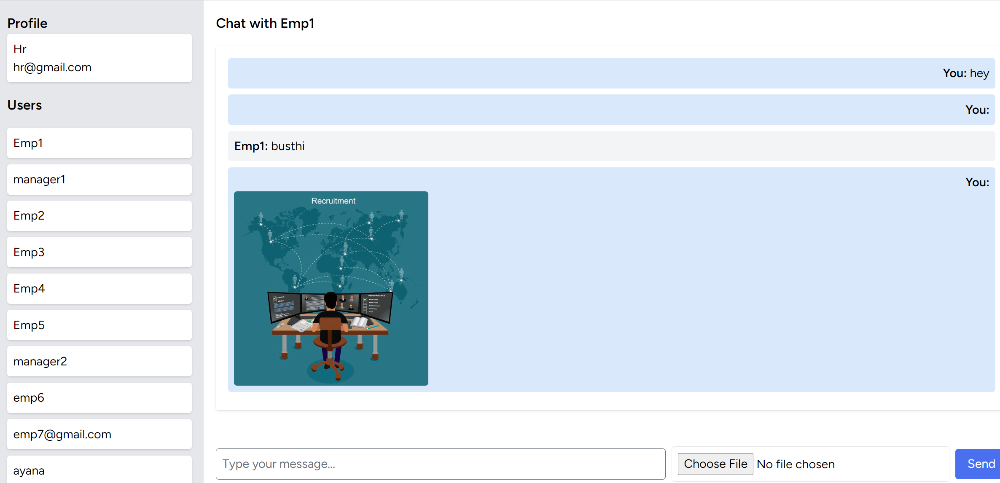
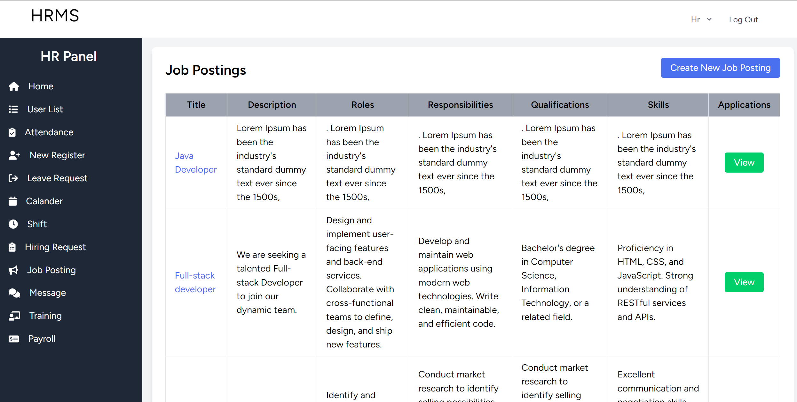

# HRMS (Human Resource Management System)

## Overview

The HRMS (Human Resource Management System) is a comprehensive application designed to manage and streamline HR operations. This project provides features for payroll management, attendance tracking, employee communication, training, and more. Built using Laravel Breeze with React, Inertia.js, and Tailwind CSS, this system aims to improve HR efficiency and enhance the user experience for both employees and managers.

## Features

-   **Payroll Management:**

    -   Generate and view payslips.
    -   Export payslips as PDF or other formats.

-   **Attendance Tracking:**

    -   Track and manage employee attendance.
    -   Notifications for attendance updates.

-   **Employee Communication:**

    -   Integrated chat feature with file uploads (photos, videos, documents).
    -   Sidebar with unread message counts and user selection.

-   **Training and Development:**

    -   Schedule and manage training sessions.
    -   Notify employees about training opportunities.

-   **Job Postings:**
    -   Display job postings on the HR dashboard.
    -   Card layout for job applicants to view and apply.

## Roles

The HRMS supports the following roles:

1. **Admin:**

    - Full access to all features and settings.
    - Manage users, roles, and permissions.

2. **HR Manager:**

    - Oversee payroll, attendance, and training management.
    - Generate reports and notifications.

3. **Department Manager:**

    - View and manage team attendance records.
    - Schedule and track training for team members.

4. **Employee:**
    - Access personal payroll and attendance information.
    - Participate in training sessions and view job postings.

## Screenshots

Below are some screenshots of the HRMS in action:

### Landing page

### Dashboard

### Payroll Management

### Attendance Tracking

### Chat Feature

### Job Posting

## Technology Stack

-   **Frontend:**

    -   React
    -   Tailwind CSS
    -   Inertia.js

-   **Backend:**

    -   Laravel Breeze
    -   PHP

-   **Database:**

    -   MySQL (or any preferred database)

-   **Additional Tools:**
    -   PDF generation library
    -   Notification system
    -   S3 storage integration

## Installation

### Prerequisites

-   PHP (>= 8.0)
-   Composer
-   Node.js (>= 14.x)
-   npm or Yarn

## Group Member
    Name                     Id
1. Ayana Basha ----------------0505/13
2. Nathenael Engliz------------2155/13
3. Yohanis Dawit---------------2922/13
